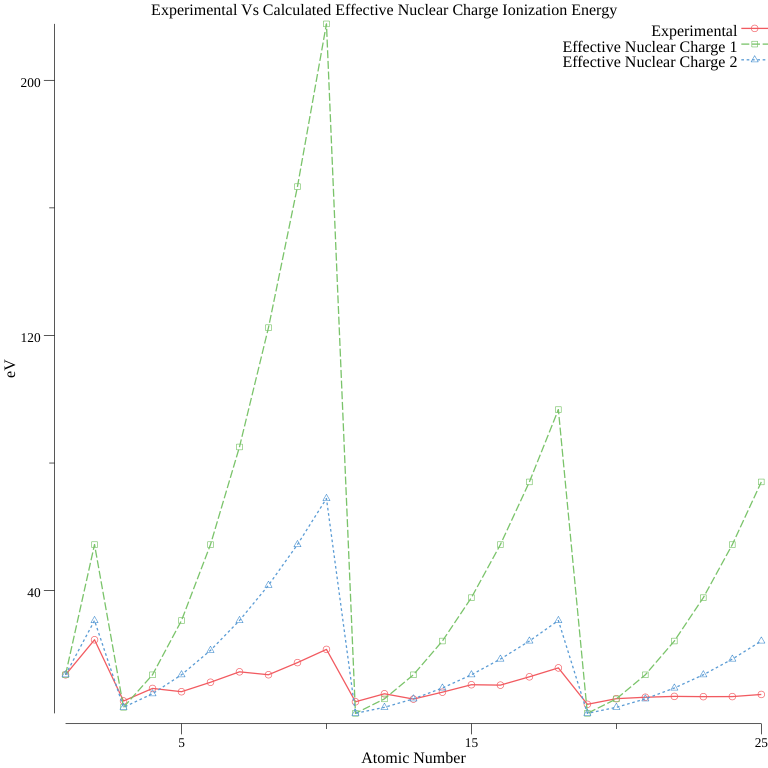

# Atomic Calculations

Some fun with atomic calculations. Currently it plots the experimental ionization energy vs two calculation of ionization energy based off the hydrogen model using different calculations of effective nuclear charge.

As you can see they both suck. It'd be better to use Slater's Rules.

This was a problem from The Oxford Solid State Basics book, an absolutely amazing book.